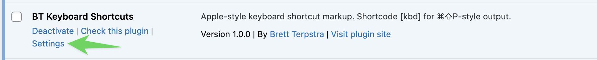
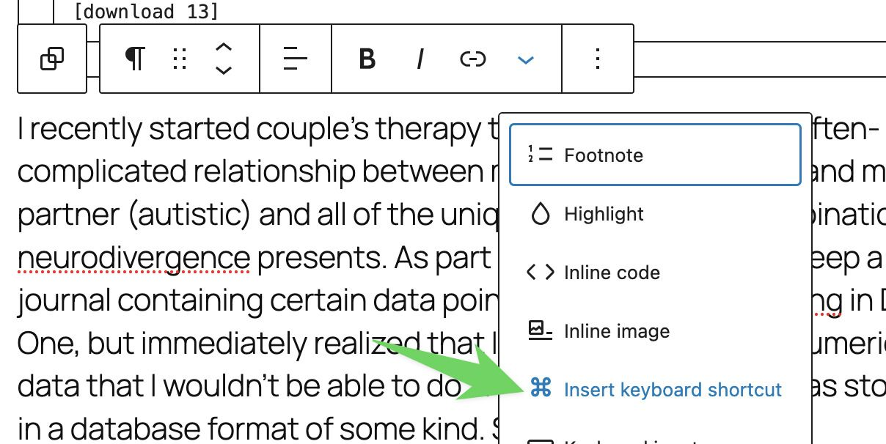
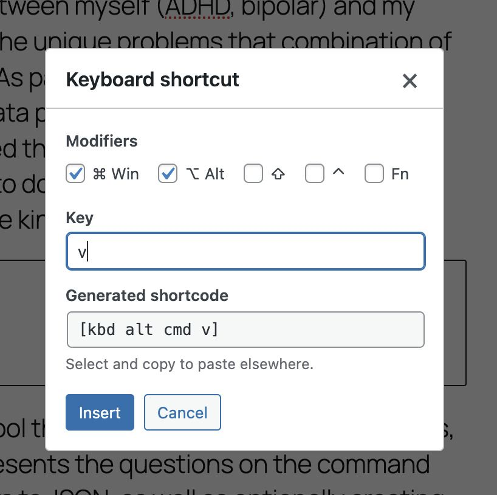
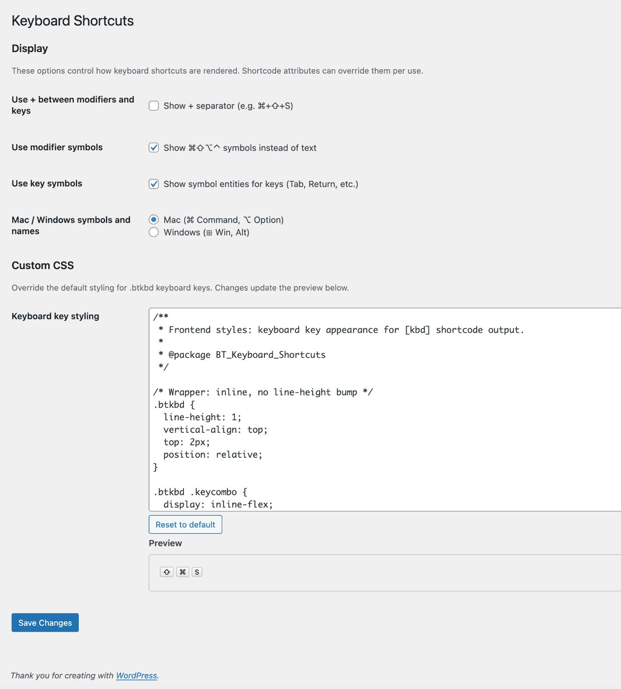
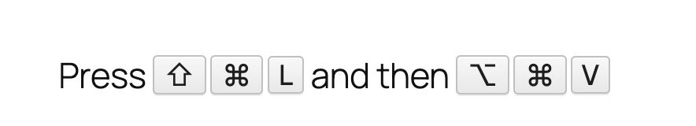

**Requires:** WordPress 5.8+, PHP 7.4+

## Features

- **Shortcode `[kbd]`** for &#x2318;&#x21E7;&#x2325;&#x2303;-style output anywhere shortcodes are supported
- **Symbols or text**: Mac/Windows modifier symbols (&#x2318;, &#x21E7;, &#x2325;, &#x2303;) or text labels (Command, Shift, Option, Control)
- **Automatically sort** modifiers in the order specified by Apple's guidelines
- **Editor integration**: Insert keyboard shortcut dialog in the classic and block editors
- **Settings page**: Toggle + separator, modifier symbols, key symbols, and Mac vs Windows naming
- **Custom CSS**: Override styling for `.btkbd` keyboard keys with live preview

## Installation

1. Download the [latest release](https://github.com/ttscoff/bt-keyboard-shortcuts/releases/latest/download/bt-keyboard-shortcuts.zip) and unzip.
2. Upload the `bt-keyboard-shortcuts` folder to `/wp-content/plugins/`.
3. Activate the plugin via **Plugins** in WordPress.
4. Go to **Settings** (under the plugin on the Plugins page) to configure display and CSS.

## Inserting shortcuts in the editor

In the block or classic editor, use the formatting dropdown and choose **Insert keyboard shortcut** to open the shortcut dialog.

In the **Keyboard shortcut** dialog, check modifier keys (Win/Alt/Shift/Ctrl/Fn), enter the main key, and use the generated shortcode. Click **Insert** to add it to the content.

## Settings

Under **Settings &rarr; Keyboard Shortcuts** (or via the plugin's **Settings** link), you can:

- **Display**: Show + separator (e.g. &#x2318;+&#x2325;+S), use modifier symbols (&#x2318;&#x21E7;&#x2325;&#x2303;) vs text, use symbol entities for keys (Tab, Return, etc.), and choose **Mac** or **Windows** symbols and names.
- **Custom CSS**: Override default styling for `.btkbd` keyboard keys. Changes update the preview below.

## Shortcode syntax

| Syntax           | Example                  | Output                                |
| ---------------- | ------------------------ | ------------------------------------- |
| Modifiers + key  | `[kbd cmd shift p]`      | &#x2318;&#x21E7;P (symbols, combined) |
| Text labels      | `[kbd cmd shift p text]` | Shift-Command-P                       |
| Shortcut symbols | `[kbd @$P]`              | Shift-Command-P                       |
| Arrow keys       | `[kbd right]`            | &rarr; Right Arrow                    |

### Supported modifiers

`cmd`/`command`, `ctrl`/`control`, `opt`/`alt`, `shift`, `fn`, `hyper`

You can also use symbol shorthand in the shortcode: `$` (Shift), `@` (Command/Win), `~` (Option), `^` (CTRL). For example, `[kbd @$p]` renders as &#x21E7;&#x2318;P.

Modifier keys are automatically rearranged to match the order recommended by Apple in their [Human Interface Guidelines](https://developer.apple.com/design/human-interface-guidelines/keyboard-shortcuts) (e.g. &#x2303; &#x2325; &#x21E7; &#x2318; before the key), regardless of the order you type them.

### Key names

`tab`, `return`, `enter`, `delete`, `esc`, `right`, `left`, `up`, `down`, `pgup`, `pgdn`, `home`, `end`, `space`, `caps`, `f1`--`f12`

## Frontend output

On the frontend, the shortcode renders as styled keycaps (e.g. &#x21E7; &#x2318; L and &#x2325; &#x2318; V), using your display and CSS settings.

## License

GPLv2 or later.
