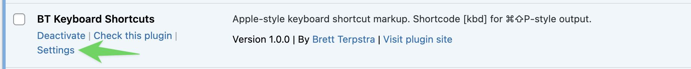
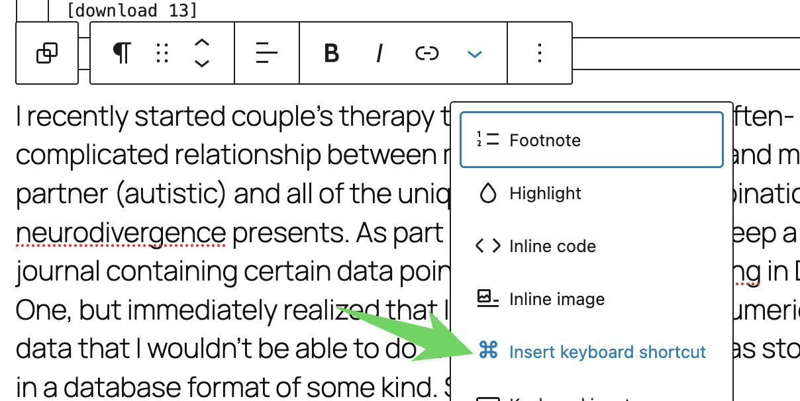
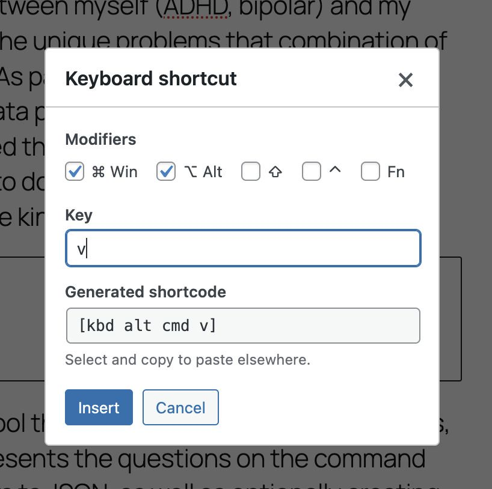
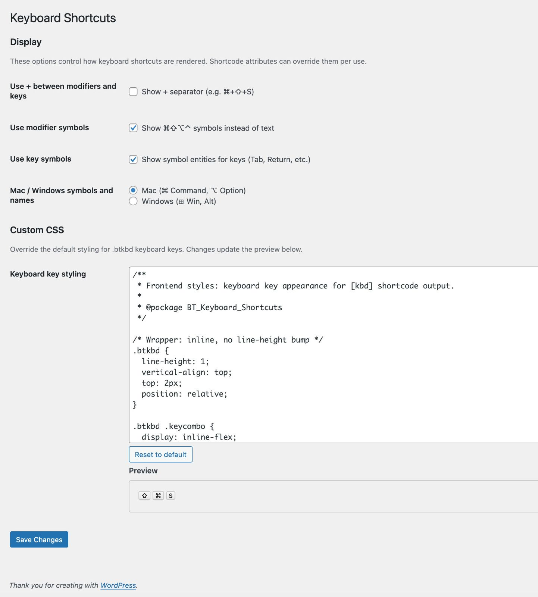
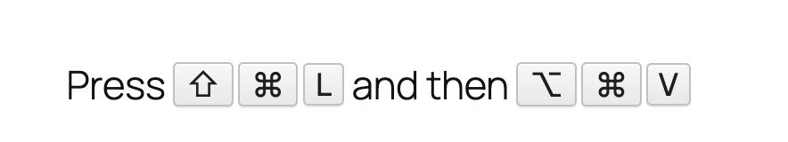

**Requires:** WordPress 5.8+, PHP 7.4+

## Features

- **Shortcode `[btkbd]`** for &#x2318;&#x21E7;&#x2325;&#x2303;-style output anywhere shortcodes are supported
- **Symbols or text**: Mac/Windows modifier symbols (&#x2318;, &#x21E7;, &#x2325;, &#x2303;) or text labels (Command, Shift, Option, Control)
- **Automatically sort** modifiers in the order specified by Apple's guidelines
- **Editor integration**: Insert keyboard shortcut dialog in the classic and block editors
- **Settings page**: Toggle + separator, modifier symbols, key symbols, Mac vs Windows naming, and built-in visual presets
- **Core CSS workflow**: Style `.btkbd` keyboard keys using WordPress's built-in Additional CSS editor

## Installation

1. In WordPress admin, go to **Plugins > Add New**, search for **BT Keyboard Shortcuts**, and install from the Plugin Directory listing: [BT Keyboard Shortcuts on WordPress.org](https://wordpress.org/plugins/bt-keyboard-shortcuts/).
2. Or download the [latest release](https://github.com/ttscoff/bt-keyboard-shortcuts/releases/latest/download/bt-keyboard-shortcuts.zip) and unzip.
3. Upload the `bt-keyboard-shortcuts` folder to `/wp-content/plugins/`.
4. Activate the plugin via **Plugins** in WordPress.
5. Go to **Settings** (under the plugin on the Plugins page) to configure display options.



## Inserting shortcuts in the editor

In the block or classic editor, use the formatting dropdown and choose **Insert keyboard shortcut** to open the shortcut dialog.



In the **Keyboard shortcut** dialog, check modifier keys (Win/Alt/Shift/Ctrl/Fn), enter the main key, and use the generated shortcode. Click **Insert** to add it to the content.



## Settings

Under **Settings &rarr; Keyboard Shortcuts** (or via the plugin's **Settings** link), you can:

- **Display**: Show + separator (e.g. &#x2318;+&#x2325;+S), use modifier symbols (&#x2318;&#x21E7;&#x2325;&#x2303;) vs text, use symbol entities for keys (Tab, Return, etc.), choose **Mac** or **Windows** symbols and names, and pick a built-in style preset (**Default**, **Light**, **Dark**, **Modern**).
- **Styling**: Use WordPress core **Additional CSS** (or block-theme Site Editor equivalent) to style `.btkbd` keyboard keys.



## Shortcode syntax

| Syntax           | Example                  | Output                                |
| ---------------- | ------------------------ | ------------------------------------- |
| Modifiers + key  | `[btkbd cmd shift p]`      | &#x2318;&#x21E7;P (symbols, combined) |
| Shortcut symbols | `[btkbd $@p]`              | &#x2318;&#x21E7;P                      |
| Hyphenated text  | `[btkbd Command-Shift-P]`  | &#x2318;&#x21E7;P                      |
| Arrow keys       | `[btkbd right]`            | &rarr; Right Arrow                    |

Display format (symbols/text and plus separators) is controlled by plugin settings.

### Supported modifiers

`cmd`/`command`, `ctrl`/`control`, `opt`/`alt`, `shift`, `fn`, `hyper`

You can also use symbol shorthand in the shortcode: `$` (Shift), `@` (Command/Win), `~` (Option), `^` (CTRL). For example, `[btkbd @$p]` renders as &#x21E7;&#x2318;P.

Modifier keys are automatically rearranged to match the order recommended by Apple in their [Human Interface Guidelines](https://developer.apple.com/design/human-interface-guidelines/keyboard-shortcuts) (e.g. &#x2303; &#x2325; &#x21E7; &#x2318; before the key), regardless of the order you type them.

### Key names

`tab`, `return`, `enter`, `delete`, `esc`, `right`, `left`, `up`, `down`, `pgup`, `pgdn`, `home`, `end`, `space`, `caps`, `f1`--`f12`

## Frontend output

On the frontend, the shortcode renders as styled keycaps (e.g. &#x21E7; &#x2318; L and &#x2325; &#x2318; V), using your display settings and theme/CSS styling.



## License

GPLv2 or later.
